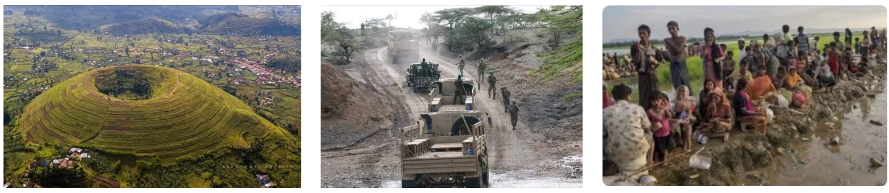

## Image contextualization for fact-checking

  

Most research in multimodal automated fact-checking focuses on predicting the veracity of multimodal claims. However, in real-world fact-checking practices, a particular attention is also given to identifying the accurate context information about the multimodal content. For example,  identifying the true location and date of the image or video, i.e., geolocation and chronolocation. 

In this project, we assemble datasets and propose methods that focus on predicting true context of multimodal misinformation content.

**Related works**

- [5Pils](https://aclanthology.org/2024.emnlp-main.448/) dataset
- [COVE](https://arxiv.org/abs/2502.01194)

