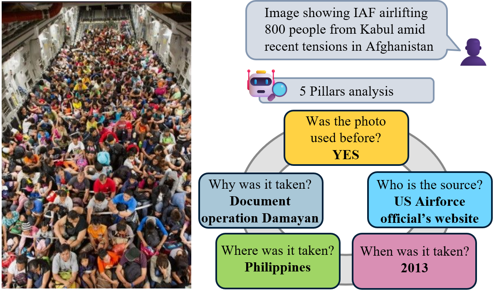

# Image contextualization for fact-checking

  

## 🗒️Summary
Most research in multimodal fact-checking focuses on predicting the veracity of multimodal claims. However, in real-world fact-checking practices, a particular attention is also given to identifying the true context of the image or video content. For example,  identifying the true date, location, or depicted event. 

In this project, we assemble datasets and propose methods to assist human fact-checkers in predicting the true context of multimodal misinformation content.

## 📖 Related works 
- [5Pils](https://aclanthology.org/2024.emnlp-main.448/) (EMNLP 2024)
- [COVE](https://arxiv.org/abs/2502.01194) (NAACL 2025)

