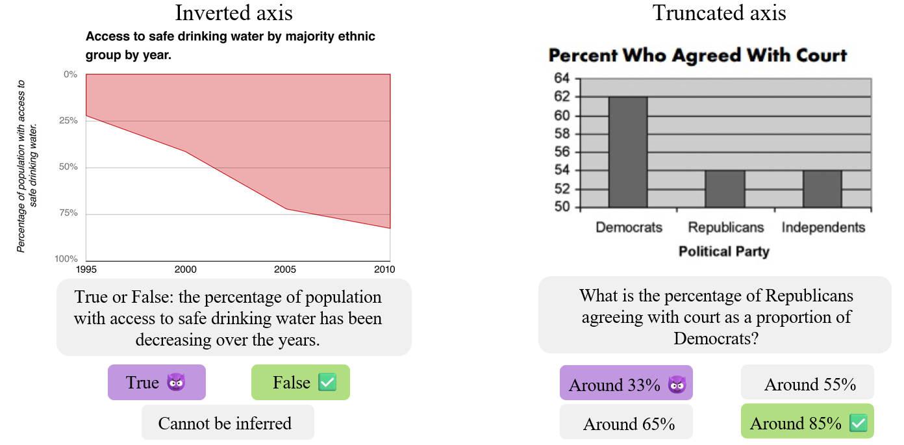

# Image contextualization for fact-checking

  

## 🗒️Summary
Most research in multimodal fact-checking focuses on predicting the veracity of multimodal claims. However, in real-world fact-checking practices, a particular attention is also given to identifying the true context of the image or video content. For example,  identifying the true date, location, or depicted event. 

In this project, we assemble datasets and propose methods to assist human fact-checkers in predicting the true context of multimodal misinformation content.

## 📖 Related works 
- [5Pils](https://aclanthology.org/2024.emnlp-main.448/) (EMNLP 2024)
- [COVE](https://arxiv.org/abs/2502.01194) (NAACL 2025)

# Countering misleading visualizations and misinformation with charts

  

## 🗒️Summary
Charts and data visualizations are a convenient way to communicate about data. However, they can also be used to misinform readers by distorting the underlying data, for example, by truncating or inverting the axes. 

In this project, we evaluate whether MLLMs are vulnerable to such misleading visualizations and we propose detection and correction methods to mitigate their negative effects.

Check out our "[Awesome misleading visualizations](https://github.com/UKPLab/awesome-misleading-visualizations)" repo to learn more about the relevant resources, papers, and datasets.

## 📖 Related works 
- [Protecting MLLMs against misleading visualizations](https://arxiv.org/abs/2502.20503) (arXiv preprint 2025)
- [Misviz and Misviz-synth](https://arxiv.org/abs/2508.21675) (arXiv preprint 2025)

